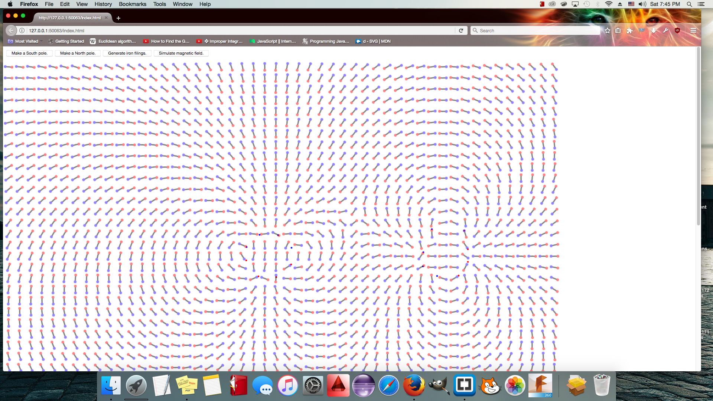

#Figuring out the math of a compass near a magnet for fun.
 

This was a project where I just puked code onto the computer without regard for organization or clean coding (which I don't excel in anyway just yet) in order to figure out the math.

In the program I call the rotating compasses "iron filings" but that is inaccurate because they are pinned into place and can only rotate, whereas iron filings would move around and form smoother lines.

In part 2 of this program I hope to make smooth lines. In part 3 I hope to make it 3D, perhaps as a python script for Blender's 3D software. One small hiccup on a blender python script is that I have not learned python yet, but no biggie.

